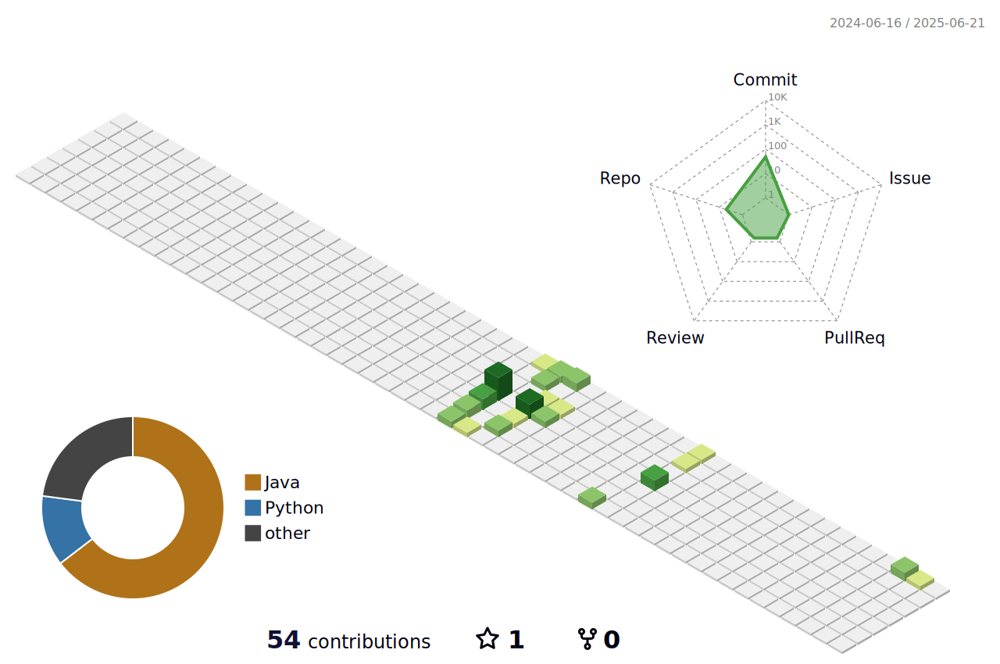

## 🎯
真正难忘的记忆，就像代码的底层逻辑，潜藏在层层代码之下，但只要被调用，就会一瞬回溯，清晰无比。时间可以抹去一些无关紧要的记忆，而真正重要的，会在时光的河里开出花来。我始终相信，技术的价值也如记忆一般，唯有用心构建、经得住时光考验的架构，才能在未来绽放光彩。

---

## 🌟 关于我

- 💻 **专注于系统设计**  
我热衷于从全局视角规划和优化系统架构，追求高效、可靠、可扩展的技术方案。通过深入理解业务需求与技术细节，力求在复杂环境中实现最优的系统平衡。

- 🌱 **持续探索的方向**

  - 关注复杂系统的设计与演化，追求架构的高可用性和灵活性。
  - 研究如何在分布式环境中实现系统性能的最优平衡。
  - 思考从系统整体性出发，如何更好地协调资源调度、数据流转和业务逻辑。

- ⚡ **我的设计理念**

  - 系统的复杂性是可以被拆解和管理的，清晰的模块化设计能带来长期的稳定性和灵活性。
  - 优秀的架构应兼顾当前需求和未来发展，既要“好用”，也要“可持续演进”。
  - 解决问题不仅是找到答案，更是选择对业务最合适的方案。

### 🚀 我的技术栈

- **道阻且长，行则将至；技术无涯，学无止境。**

---

### 📊 我的 GitHub 数据

  
  
  

---

### 📈 Metrics

  

---

### 📫 联系方式

- 📧 邮箱：lyx971228@163.com
- 🌐 个人公众号：**敬请期待！**

---

